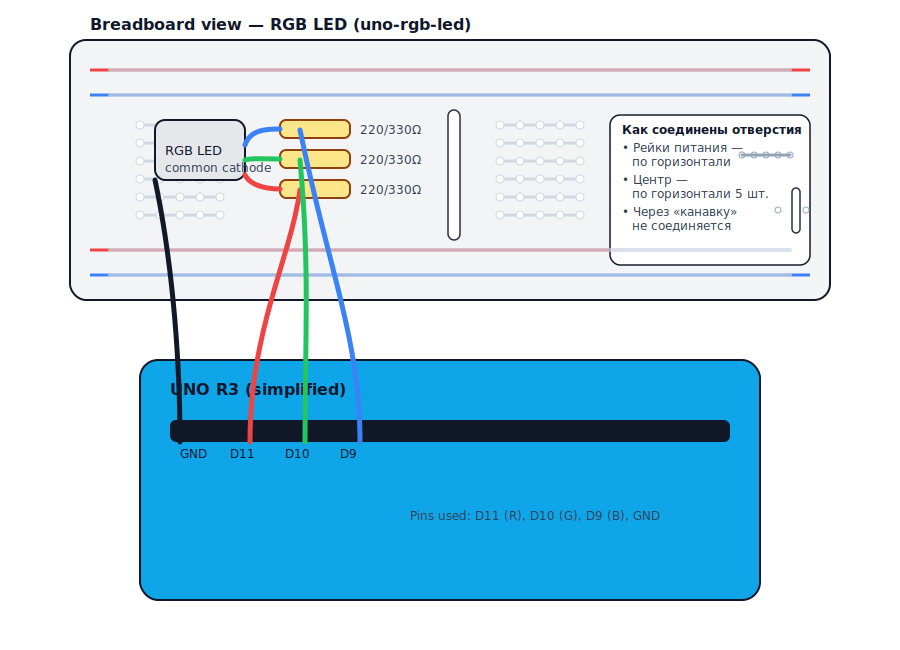
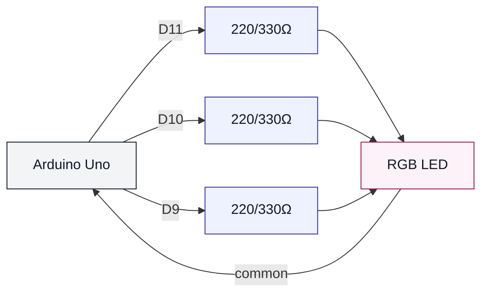

# RGB LED (uno-rgb-led)

## Что нужно из набора

- RGB светодиод
- 3 резистора 220Ω или 330Ω
- Провода

## Подключение

## Иллюстрация (как на макетке)

- R → D11 через резистор
- G → D10 через резистор
- B → D9 через резистор
- Общий вывод → GND (для common cathode)

## Проверка

- Залить: `pio run -t upload -e uno-rgb-led`

## Если цвета не такие

- У некоторых RGB другой порядок ножек — попробуй переставить провода R/G/B.
- Если RGB “общий плюс” (common anode), схема будет другой.
