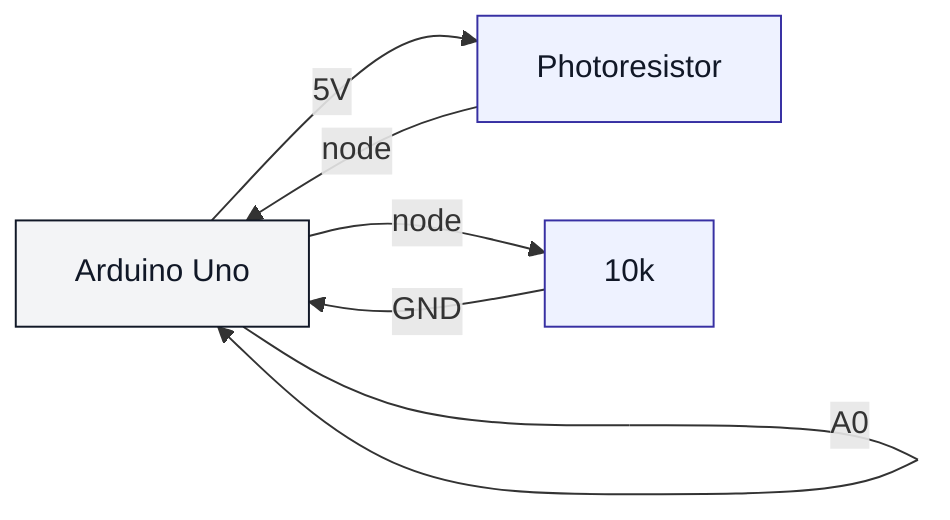

# Photoresistor / LDR (uno-photoresistor)

## Что нужно из набора

- Фоторезистор
- Резистор 10k
- Провода + макетная плата

## Подключение (делитель напряжения)

- 5V → LDR → (точка) → A0
- Из точки → резистор 10k → GND

## Проверка

- Залить: `pio run -t upload -e uno-photoresistor`
- Монитор: `pio device monitor -b 115200`
