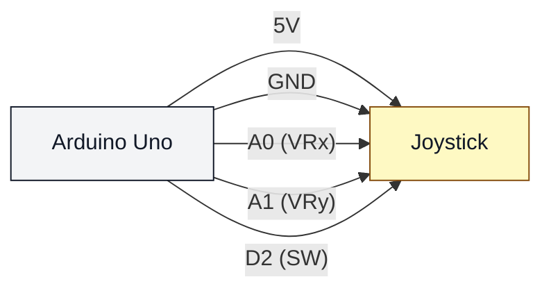

# Joystick (uno-joystick)

## Что нужно из набора

- Джойстик-модуль
- Провода

## Подключение

- VCC → 5V
- GND → GND
- VRx → A0
- VRy → A1
- SW → D2 (в этом скетче включена внутренняя подтяжка pull-up)

## Проверка

- Залить: `pio run -t upload -e uno-joystick`
- Монитор: `pio device monitor -b 115200`
