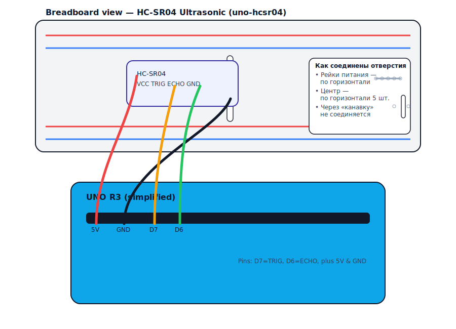
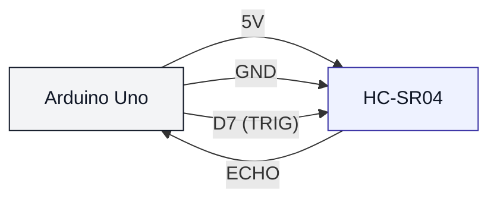

# HC-SR04 Ultrasonic (uno-hcsr04)

## Что нужно из набора

- HC-SR04
- Провода (jumper wires)
- Макетная плата (по желанию)

## Подключение

## Иллюстрация (как на макетке)

- VCC → 5V
- GND → GND
- TRIG → D7
- ECHO → D6

## Проверка

- Залить: `pio run -t upload -e uno-hcsr04`
- Открыть монитор: `pio device monitor -b 115200`

## Важно

- Для Arduino Uno (5V) ECHO обычно можно подключать напрямую.
- Для плат 3.3V часто нужен делитель на ECHO.
