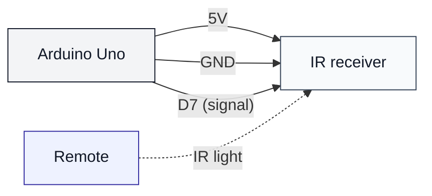

# IR Receiver (uno-ir-receiver)

## Что нужно из набора

- ИК‑приёмник
- ИК‑пульт
- Провода

## Подключение

- VCC → 5V
- GND → GND
- SIGNAL → D7

## Проверка

- Залить: `pio run -t upload -e uno-ir-receiver`
- Монитор: `pio device monitor -b 115200`
