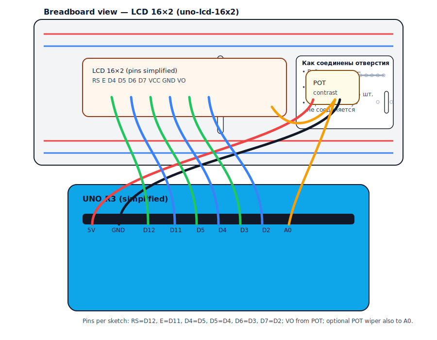
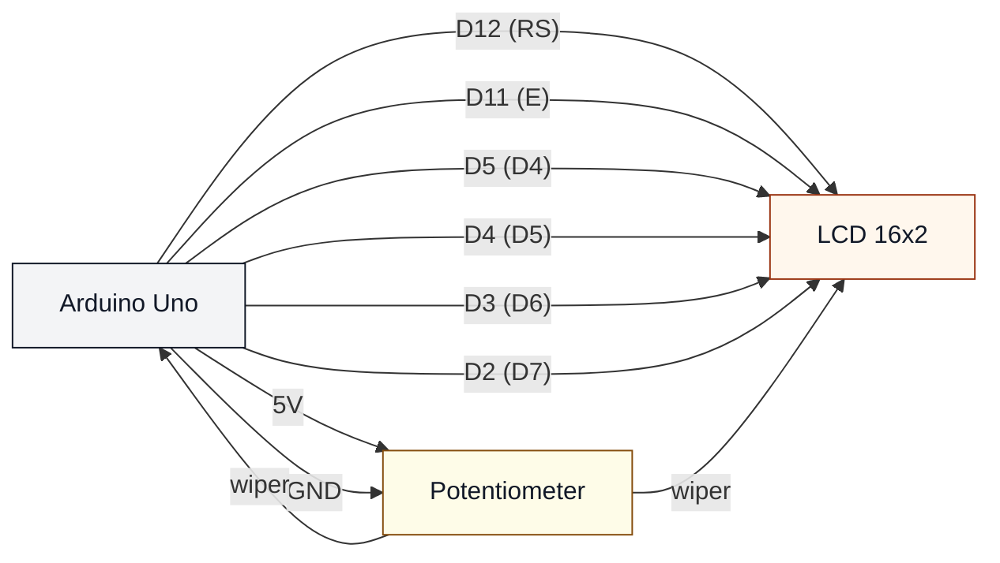

# LCD 16x2 (uno-lcd-16x2)

## Что нужно из набора

- LCD 16×2 (параллельный)
- Потенциометр (контраст)
- Провода + макетная плата

## Подключение (как в коде)

### Вариант A — I2C (4 провода) — основной для этого скетча

Если на твоём дисплее есть 4 пина `GND`, `VCC`, `SDA`, `SCL`, значит это LCD с I2C-платкой ("backpack").

- `GND` → GND (Arduino)
- `VCC` → 5V (Arduino)
- `SDA` → A4 (SDA на Uno)
- `SCL` → A5 (SCL на Uno)

Контраст обычно регулируется **маленьким подстроечником** на I2C-платке.

Этот скетч ещё читает `A0` и показывает число на второй строке. Это необязательно: если `A0` не подключать, значение может быть «шумным».

### Вариант B — параллельный (16 пинов) — альтернативный

Если у тебя "голый" LCD с линейкой из 16 пинов (`VSS/VDD/V0/RS/RW/E/D0..D7/...`), то это **параллельный** вариант.

Отличия от I2C:

- Нужно больше проводов (обычно 6 сигнальных + питание).
- Контраст почти всегда делается **внешним потенциометром** на `V0`.
- Нужен другой код/подключение (классический `LiquidCrystal`), т.к. текущий скетч рассчитан на I2C.

Для параллельного варианта (пример типичного подключения):

- `RS` → D12
- `E` → D11
- `D4` → D5
- `D5` → D4
- `D6` → D3
- `D7` → D2
- `RW` → GND

Питание и контраст (первые 3 пина):

- `VSS` (pin 1) → GND
- `VDD` (pin 2) → 5V
- `V0/VO/VEE` (pin 3) → середина потенциометра (края потенциометра: 5V и GND)

## Иллюстрация (как на макетке)

Картинка ниже показывает **параллельный (16-пиновый)** вариант.

- RS → D12
- E → D11
- D4 → D5
- D5 → D4
- D6 → D3
- D7 → D2

## Контраст (V0/VO)

Контраст LCD настраивается потенциометром:

- один край потенциометра → 5V
- другой край → GND
- середина → V0/VO на LCD

### Если на LCD нет маркировок “V0/VO”

На большинстве LCD 16×2 (совместимых с контроллером HD44780) контраст — это **3-й пин** в стандартной гребёнке на 16 контактов.

Как обычно нумеруются пины:

- Поверни дисплей **экраном к себе**.
- Гребёнка из 16 пинов обычно идёт вдоль верхнего/нижнего края.
- **Pin 1 — самый левый**, дальше 2, 3, ...

Стандартные названия первых трёх пинов:

- **1: VSS** → GND
- **2: VDD** → +5V
- **3: VO / V0 / VEE** → сюда идёт **середина потенциометра** (контраст)

Если у тебя модуль с I2C-платкой (“backpack”, обычно 4 пина: GND/VCC/SDA/SCL), то отдельного pin-3 “VO” ты не увидишь — контраст там крутится маленьким подстроечником на самой платке.

Этот скетч дополнительно читает потенциометр на A0, поэтому можно сделать перемычку:

- середина потенциометра → A0

## Проверка

- Залить: `pio run -t upload -e uno-lcd-16x2`

## Если экран пустой

- Покрути потенциометр: контраст — самая частая причина.
