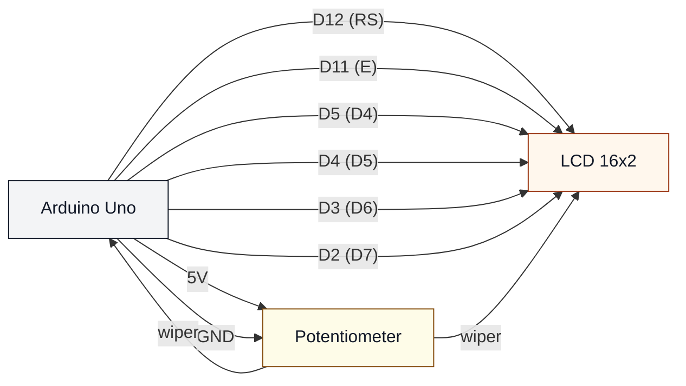

# LCD 16x2 (uno-lcd-16x2)

## Что нужно из набора

- LCD 16×2 (параллельный)
- Потенциометр (контраст)
- Провода + макетная плата

## Подключение (как в коде)

- RS → D12
- E → D11
- D4 → D5
- D5 → D4
- D6 → D3
- D7 → D2

## Контраст (V0/VO)

Контраст LCD настраивается потенциометром:

- один край потенциометра → 5V
- другой край → GND
- середина → V0/VO на LCD

Этот скетч дополнительно читает потенциометр на A0, поэтому можно сделать перемычку:

- середина потенциометра → A0

## Проверка

- Залить: `pio run -t upload -e uno-lcd-16x2`

## Если экран пустой

- Покрути потенциометр: контраст — самая частая причина.
