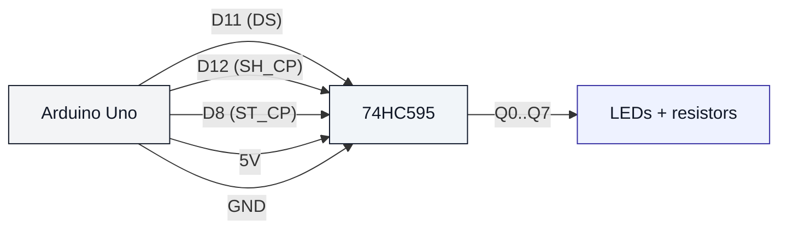

# 74HC595 Shift Register (uno-74hc595)

## Что нужно из набора

- 74HC595N
- Провода
- (Рекомендуется) 8 светодиодов + 8 резисторов 220/330Ω

## Управляющие пины (как в коде)

- DS (data) → D11
- SH_CP (clock) → D12
- ST_CP (latch) → D8

## Проверка

- Залить: `pio run -t upload -e uno-74hc595`

## Примечание

74HC595 имеет дополнительные пины (OE/MR), которые обычно фиксируют в нужные уровни. В этом репозитории скетч показывает принцип работы “сдвигового регистра”; если хочешь — добавлю подробную распиновку для макетки.
