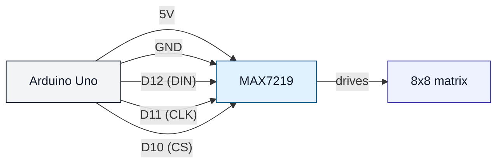

# MAX7219 + 8x8 Matrix (uno-max7219-matrix)

## Что нужно из набора

- MAX7219 модуль
- Матрица 8×8
- Провода

## Подключение (как в коде)

- VCC → 5V
- GND → GND
- DIN → D12
- CLK → D11
- CS → D10

## Проверка

- Залить: `pio run -t upload -e uno-max7219-matrix`
