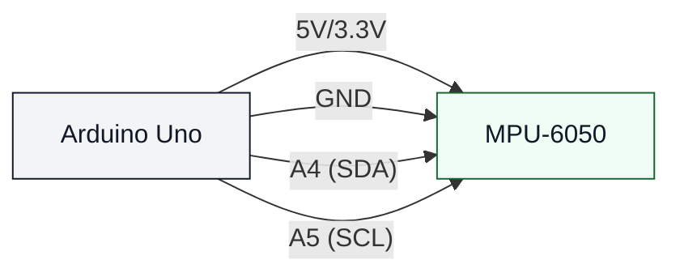

# MPU-6050 (uno-mpu6050)

## Что нужно из набора

- MPU-6050
- 4 провода (лучше папа-мама)

## Подключение (I2C)

- VCC → 5V (или 3.3V, если на модуле отмечено `3V3`)
- GND → GND
- SDA → A4
- SCL → A5

## Проверка

- Залить: `pio run -t upload -e uno-mpu6050`
- Открыть монитор: `pio device monitor -b 115200`

## Если не работает

- Если в Serial написано `MPU6050 not found`:
  - перепроверь SDA/SCL,
  - перепроверь питание,
  - проверь, не требует ли твой модуль 3.3V.
