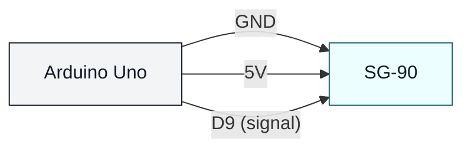

# Servo SG-90 (uno-servo-sg90)

## Что нужно из набора

- Сервопривод SG-90
- Провода

## Подключение

Обычно цвета такие:

- GND: коричневый/чёрный → GND
- +5V: красный → 5V (или внешний 5V)
- SIGNAL: оранжевый/жёлтый/белый → D9

## Проверка

- Залить: `pio run -t upload -e uno-servo-sg90`

## Важно

- Если серво дёргается или Arduino перезагружается — используй внешний 5V источник для серво.
- При внешнем питании обязательно соедини земли: GND источника и GND Arduino.
