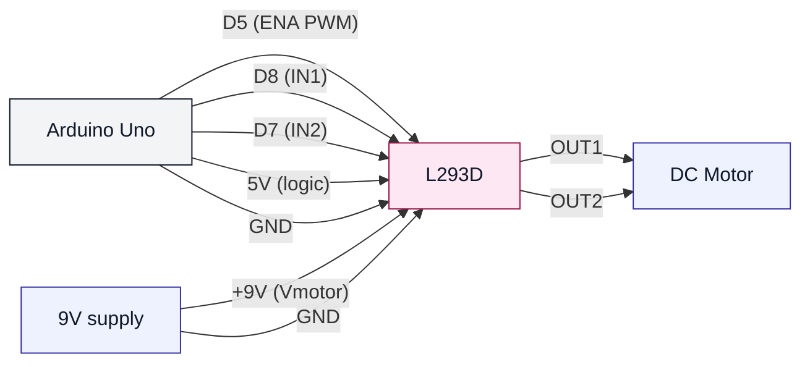

# DC Motor + L293D (uno-dc-motor-l293d)

## Что нужно из набора

- Двигатель постоянного тока
- L293D
- Адаптер 9V (или батарейка) для питания мотора
- Провода + макетная плата

## Сигнальные пины (как в коде)

- ENA (PWM скорость) → D5
- IN1 (направление) → D8
- IN2 (направление) → D7

## Важно (чтобы не перезагружалась Arduino)

- GND у Arduino и GND у питания мотора должны быть общими.
- Мотор нельзя питать напрямую от 5V пина Arduino.

## Проверка

- Залить: `pio run -t upload -e uno-dc-motor-l293d`

## SVG-схема

- Упрощённая картинка: ../../docs/images/l293d_dc_motor.svg
