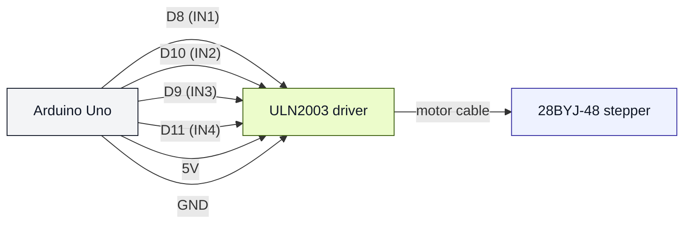

# Stepper 28BYJ-48 + ULN2003 (uno-stepper-28byj48)

## Что нужно из набора

- Шаговый двигатель 28BYJ-48
- Драйвер ULN2003
- Провода

## Подключение (как в коде)

- IN1 → D8
- IN2 → D10
- IN3 → D9
- IN4 → D11
- VCC → 5V
- GND → GND

## Проверка

- Залить: `pio run -t upload -e uno-stepper-28byj48`

## SVG-схема

- Упрощённая картинка: ../../docs/images/uln2003_stepper.svg
